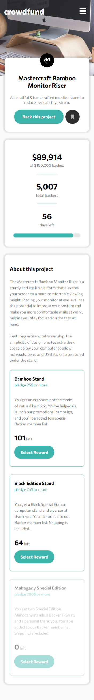
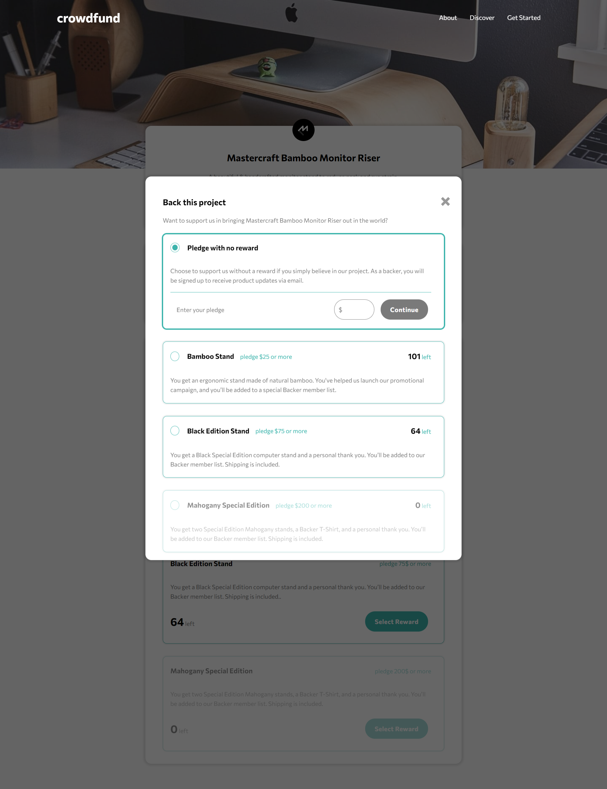
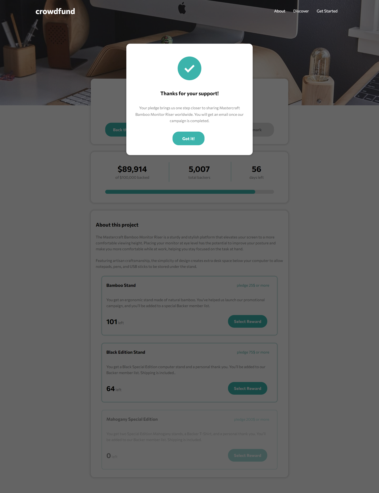

# Frontend Mentor - Crowdfunding product page solution

It's the first time I've tackled with modules in js and got into more modular approach at all. In this project a lot of my
focus gone into learning how to structure my projects properly eg. using folders for components, different modules etc.
I hope to get better understanding of the subject as I'll build my future projects with more modular approach.

This is a solution to the [Crowdfunding product page challenge on Frontend Mentor](https://www.frontendmentor.io/challenges/crowdfunding-product-page-7uvcZe7ZR). Frontend Mentor challenges help you improve your coding skills by building realistic projects.

## Table of contents

- [Overview](#overview)
  - [The challenge](#the-challenge)
  - [Screenshots](#screenshot)
  - [Links](#links)
- [My process](#my-process)
  - [Built with](#built-with)
  - [What I learned](#what-i-learned)
  - [Useful resources](#useful-resources)
- [Author](#author)

## Overview

### The challenge

Users should be able to:

- View the optimal layout depending on their device's screen size
- See hover states for interactive elements
- Make a selection of which pledge to make
- See an updated progress bar and total money raised based on their pledge total after confirming a pledge
- See the number of total backers increment by one after confirming a pledge
- Toggle whether or not the product is bookmarked

### Screenshots

### Links

- Solution URL: [Add solution URL here](https://www.frontendmentor.io/solutions/crowdfunding-page-made-with-vanilla-js-sass-modular-approach-ZAa4BXXAUj)
- Live Site URL: [https://kamilp522.github.io/crowdfunding-page/](https://kamilp522.github.io/crowdfunding-page/)

## My process

### Built with

- Semantic HTML5 markup
- Flexbox
- Mobile-first workflow
- [Sass](https://sass-lang.com/) - preprocessor for css
- Js modules

### Useful resources

- [resource 1](https://www.matteogregoricchio.com/articles/github-pages-hosting-with-parcel) - This blog article by Matteo Gregoricchio helped me tremendously with deploying my project on github pages.

## Author

- Frontend Mentor - [@yourusername](https://www.frontendmentor.io/profile/kamilp522)
